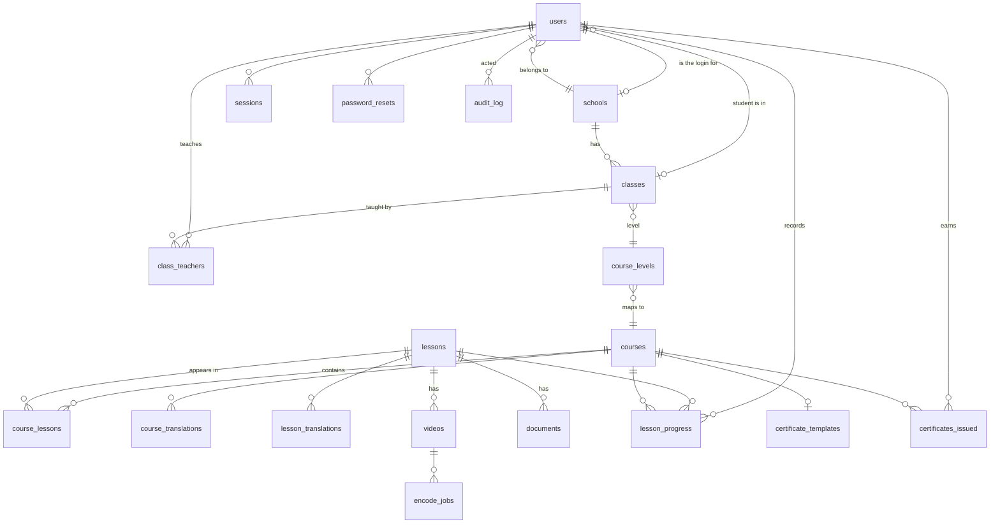

# AI Veda — Target Schema

**Task `P1-01`. Review this before the migrations in `P1-02`…`P1-08` are written.**

Today's schema has eight tables and models the course catalogue only — no users, no
organisation, no progress, no language. This is the shape it needs to become, derived from the
decisions in [BRIEF-DETAIL.md](./BRIEF-DETAIL.md).

**19 tables and 1 view.** Everything is new or rebuilt; there is no production data to preserve.

---

## Conventions

| | |
| --- | --- |
| **Ids** | `TEXT`, prefixed and random — `usr_`, `sch_`, `crs_`, `lsn_`, `vid_`. Unchanged from today: readable in logs, safe in URLs |
| **Timestamps** | **`timestamptz`, not ISO text.** This is a change — see below |
| **Locales** | `TEXT` constrained to `'en'` or `'ml'` |
| **Booleans** | real `boolean`, not `INTEGER 0/1` — also a change |
| **Deletes** | `CASCADE` only where the child is meaningless alone. People and progress use `RESTRICT` |
| **Naming** | `snake_case`, plural tables, `<entity>_id` foreign keys |

### Two convention changes, both free to make now

**Timestamps become `timestamptz`.** Today every timestamp is ISO-8601 `TEXT`, which was a
reasonable simplification when the app only listed courses. It stops being reasonable the
moment teachers ask *"who hasn't watched anything in a week"* — that is date arithmetic, and
text columns cannot do it without casting on every row. Changing costs nothing today and a
migration later.

**Booleans become `boolean`.** `certificates.enabled INTEGER NOT NULL DEFAULT 1` is a SQLite
habit carried into Postgres. Same reasoning: free now.

### Authorisation is in the application, not the database

We connect as a pooled Postgres user, not through PostgREST, so **Supabase Row Level Security
is not in play and must not be relied on.** Every access rule in the brief is enforced in
route handlers and middleware (`P2-04`, `P2-05`). Stated explicitly so nobody later assumes a
policy is protecting a table when nothing is.

---

## Diagram



---

## Identity and access

### `users`

One table for all four roles, so sign-in has exactly one code path (`D-14`).

| Column | Type | Notes |
| --- | --- | --- |
| `id` | `text` PK | `usr_…` |
| `username` | `text` NOT NULL | Unique on `lower(username)` |
| `password_hash` | `text` NOT NULL | Argon2id |
| `role` | `text` NOT NULL | `super_admin` · `school` · `teacher` · `student` |
| `full_name` | `text` NOT NULL | For a school account, the school's name |
| `email` | `text` NULL | Unique when present. **Never set on students** |
| `school_id` | `text` NULL → `schools` | Null only for `super_admin` |
| `class_id` | `text` NULL → `classes` | Students only; a student is in exactly one class |
| `status` | `text` NOT NULL | `active` · `disabled`. Default `active` |
| `must_change_password` | `boolean` NOT NULL | Set by a reset; cleared on next sign-in |
| `last_login_at` | `timestamptz` NULL | Powers "last active" in teacher views |
| `created_at` / `updated_at` | `timestamptz` NOT NULL | |

**Indexes** — unique `lower(username)`; unique `lower(email)` where not null;
`(school_id, role)`; `(class_id)` where role = `student`.

**Constraints worth writing down** rather than trusting to application code:

- `super_admin` ⇒ `school_id IS NULL`; every other role ⇒ `school_id IS NOT NULL`
- `student` ⇒ `class_id IS NOT NULL` and `email IS NULL`
- `role IN ('super_admin','school','teacher','student')`

**Why students have no email.** They are provisioned by a teacher and recover through the
reset chain (`D-04`). A null email is not missing data — it is the design, and the check
constraint stops a well-meaning import from filling it in.

### `sessions`

| Column | Type | Notes |
| --- | --- | --- |
| `id` | `text` PK | **Hash** of the cookie token, never the token |
| `user_id` | `text` NOT NULL → `users` | `ON DELETE CASCADE` |
| `expires_at` | `timestamptz` NOT NULL | |
| `created_at` | `timestamptz` NOT NULL | |

**Index** `(user_id)`, `(expires_at)` for sweeping. Storing the hash means a leaked database
backup does not hand over live sessions.

### `password_resets`

Only ever populated for the super admin's email recovery. Every other reset is performed
directly by the level above and writes an `audit_log` row instead — there is no token to
manage when a teacher reads a new password aloud.

| Column | Type | Notes |
| --- | --- | --- |
| `id` | `text` PK | |
| `user_id` | `text` NOT NULL → `users` | `ON DELETE CASCADE` |
| `token_hash` | `text` NOT NULL | |
| `expires_at` | `timestamptz` NOT NULL | 1 hour |
| `used_at` | `timestamptz` NULL | Single use |

### `audit_log`

| Column | Type | Notes |
| --- | --- | --- |
| `id` | `text` PK | |
| `actor_user_id` | `text` NULL → `users` | `ON DELETE SET NULL` — keep the record if the actor is deleted |
| `action` | `text` NOT NULL | `password.reset`, `student.import`, `course.publish`, … |
| `target_type` | `text` NULL | `user`, `course`, `school` |
| `target_id` | `text` NULL | Deliberately not a foreign key — targets outlive their rows |
| `detail` | `jsonb` NULL | Never credentials |
| `created_at` | `timestamptz` NOT NULL | |

**Index** `(created_at DESC)`, `(actor_user_id, created_at DESC)`, `(target_type, target_id)`.

---

## Organisation

### `schools`

| Column | Type | Notes |
| --- | --- | --- |
| `id` | `text` PK | `sch_…` |
| `user_id` | `text` NOT NULL UNIQUE → `users` | The school's own login (`D-14`) |
| `name` | `text` NOT NULL | Unique on `lower(name)` |
| `district` | `text` NULL | |
| `code` | `text` NULL UNIQUE | Government school code, when known |
| `is_demo` | `boolean` NOT NULL | Default false. Excludes the `D-16` demo data from analytics |
| `created_at` / `updated_at` | `timestamptz` NOT NULL | |

**The unique index on `lower(name)` is load-bearing.** Roster import matches schools by name
from a spreadsheet column (`D-15`). Without case-insensitive uniqueness, "GHSS Kochi" and
"GHSS KOCHI" become two schools and the import silently splits a roster across both.

`schools.user_id` and `users.school_id` reference each other. The school's own user row has
`school_id` pointing back at its school — created in one transaction, so the cycle never
exists half-formed.

### `classes`

| Column | Type | Notes |
| --- | --- | --- |
| `id` | `text` PK | |
| `school_id` | `text` NOT NULL → `schools` | `ON DELETE RESTRICT` |
| `name` | `text` NOT NULL | `6B`, `10A` |
| `level` | `smallint` NOT NULL | 5–12. Determines the course |
| `academic_year` | `text` NOT NULL | `2026-27` |
| `created_at` / `updated_at` | `timestamptz` NOT NULL | |

**Unique** `(school_id, academic_year, lower(name))`. **Check** `level BETWEEN 5 AND 12`.

`ON DELETE RESTRICT` is deliberate: deleting a class that still has students should fail
loudly, not silently orphan or destroy children's progress records.

### `class_teachers`

A class can have more than one teacher, and a teacher more than one class.

| Column | Type | Notes |
| --- | --- | --- |
| `class_id` | `text` NOT NULL → `classes` | `ON DELETE CASCADE` |
| `teacher_user_id` | `text` NOT NULL → `users` | `ON DELETE CASCADE` |
| `created_at` | `timestamptz` NOT NULL | |

**PK** `(class_id, teacher_user_id)`. **Index** `(teacher_user_id)` — every teacher screen
starts here.

---

## Content

Chapters are gone. The curriculum is a flat, ordered list of sessions per course
(`P1-12`), so a chapters table would exist only to hold one row per course.

### `courses`

| Column | Type | Notes |
| --- | --- | --- |
| `id` | `text` PK | |
| `slug` | `text` NOT NULL UNIQUE | `explorer`, `builder`, `achiever` |
| `accent` | `text` NULL | Thumbnail gradient |
| `status` | `text` NOT NULL | `draft` · `published` |
| `position` | `integer` NOT NULL | |
| `created_at` / `updated_at` | `timestamptz` NOT NULL | |

Title, subtitle and audience live in `course_translations` — they are language-dependent.

### `course_levels`

Which class levels see which course. Data, not a hard-coded mapping, so a school with an
unusual arrangement is a row rather than a deployment.

| Column | Type | Notes |
| --- | --- | --- |
| `course_id` | `text` NOT NULL → `courses` | `ON DELETE CASCADE` |
| `level` | `smallint` NOT NULL | |

**PK** `(level)` — one course per level. Seeded: 5,6,7 → Explorer · 8,9,10 → Builder ·
11,12 → Achiever.

### `lessons`

The content unit. **Not owned by a course** — that is what makes Builder and Achiever share
eight sessions instead of duplicating them.

| Column | Type | Notes |
| --- | --- | --- |
| `id` | `text` PK | `lsn_…` |
| `duration_min` | `smallint` NOT NULL | Default 30 |
| `tools` | `text` NULL | Authored later; the curriculum source does not supply it |
| `created_at` / `updated_at` | `timestamptz` NOT NULL | |

### `course_lessons`

| Column | Type | Notes |
| --- | --- | --- |
| `course_id` | `text` NOT NULL → `courses` | `ON DELETE CASCADE` |
| `lesson_id` | `text` NOT NULL → `lessons` | `ON DELETE RESTRICT` |
| `position` | `integer` NOT NULL | 1-based, within the course |
| `is_advanced` | `boolean` NOT NULL | Default false. Achiever's last two |

**PK** `(course_id, lesson_id)`. **Unique** `(course_id, position)`. **Index** `(lesson_id)`
— needed to answer "which courses would this lesson edit affect?"

`ON DELETE RESTRICT` on the lesson: deleting a lesson still used by a course should fail. It
is shared, and the person deleting it is probably looking at only one course.

### `course_translations` · `lesson_translations`

| Column | Type | Notes |
| --- | --- | --- |
| `course_id` / `lesson_id` | `text` NOT NULL | `ON DELETE CASCADE` |
| `locale` | `text` NOT NULL | `en` · `ml` |
| `title` | `text` NOT NULL | |
| `subtitle` / `covers` | `text` NULL | Course: subtitle + audience. Lesson: what it covers |

**PK** `(course_id, locale)` / `(lesson_id, locale)`.

**Fallback rule:** if a row is missing for `ml`, the app serves `en`. A half-translated course
must render, not 500 — and with content arriving through 13 September, half-translated is the
normal state for most of the build.

Two separate `_en` / `_ml` column sets would have been simpler for exactly two languages. The
translation table wins because it makes "which lessons are missing Malayalam?" a query rather
than a scan of nullable columns — and that question gets asked daily until launch.

---

## Assets

Video and documents are separate tables. A single `assets` table would carry ten
encode-specific columns that are null on every PDF row. The `lesson_assets` view below gives
the single-query slot grid the Studio needs (`P5-13`) without that cost.

### `videos`

| Column | Type | Notes |
| --- | --- | --- |
| `id` | `text` PK | `vid_…` |
| `lesson_id` | `text` NOT NULL → `lessons` | `ON DELETE CASCADE` |
| `locale` | `text` NOT NULL | Separate video per language (`Q1`) |
| `original_name` | `text` NULL | |
| `status` | `text` NOT NULL | `pending` · `encoding` · `uploading` · `ready` · `error` |
| `progress` | `real` NOT NULL | 0–1 |
| `stage` | `text` NULL | Human-readable step |
| `storage` | `text` NULL | `r2` · `local` |
| `storage_key` | `text` NULL | Key **prefix**, e.g. `hls/vid_abc123`. Not a URL — see below |
| `has_poster` | `boolean` NOT NULL | Poster generation can fail without failing the encode |
| `renditions` | `text[]` NULL | Was a JSON string; a real array now |
| `duration_sec` | `real` NULL | Measured at encode. Drives the 90% completion rule |
| `error` | `text` NULL | |
| `created_at` / `updated_at` | `timestamptz` NOT NULL | |

**Index** `(lesson_id, locale, created_at DESC)`.

**Several rows per (lesson, locale) are allowed, and the app takes the newest `ready` one.**
Today's code takes the newest row of any status, which means a failed re-encode replaces a
working video with a broken one. Selecting the newest *ready* row means a bad re-encode is
visible in the Studio and invisible to students.

#### Keys, not URLs

Today the pipeline builds an absolute URL at encode time and stores it:

```
master_url = "https://pub-abc123.r2.dev/hls/vid_xyz/master.m3u8"
```

The delivery domain is therefore baked into every row, and changing it becomes a data
migration across the whole table. That is about to matter twice in ten days: `P0-08` moves
delivery to a custom domain, and `P6-14` puts a Worker in front of the bucket (`D-17`), which
may change the URL shape again.

So the table stores the **key** and the application builds the URL when it reads:

| Storage | URL |
| --- | --- |
| `r2` | `${R2_PUBLIC_URL}/${storage_key}/master.m3u8` |
| `local` | `/${storage_key}/master.m3u8` |

The delivery domain becomes configuration rather than data — one environment variable, no
UPDATE. `has_poster` replaces the nullable `poster_url` that used to carry the same signal.

### `documents`

| Column | Type | Notes |
| --- | --- | --- |
| `id` | `text` PK | |
| `lesson_id` | `text` NOT NULL → `lessons` | `ON DELETE CASCADE` |
| `kind` | `text` NOT NULL | `worksheet` · `handout` |
| `locale` | `text` NOT NULL | |
| `title` | `text` NOT NULL | |
| `filename` | `text` NOT NULL | Original upload name, for display |
| `storage_key` | `text` NOT NULL | Full object key, e.g. `pdfs/file_abc123.pdf` |
| `storage` | `text` NOT NULL | `r2` · `local` |
| `size_bytes` | `integer` NULL | |
| `created_at` | `timestamptz` NOT NULL | |

**Unique** `(lesson_id, kind, locale)` — exactly one worksheet and one handout per language
per lesson. Re-upload replaces.

Same rule as videos: the key is stored, the URL is built on read. PDFs are served from the
same bucket and will sit behind the same domain and Worker.

### `lesson_assets` (view)

Flattens both tables into one row per filled slot, so the completeness grid is one query:

```sql
CREATE VIEW lesson_assets AS
  SELECT lesson_id, 'video'::text AS kind, locale, status = 'ready' AS is_ready
    FROM videos
  UNION ALL
  SELECT lesson_id, kind, locale, true FROM documents;
```

Six slots per lesson × 16 lessons = the 96 assets the brief counts.

### `encode_jobs`

Retires the in-memory `Set` that loses work when the encoder machine sleeps (`D-06`).

| Column | Type | Notes |
| --- | --- | --- |
| `id` | `text` PK | |
| `video_id` | `text` NOT NULL → `videos` | `ON DELETE CASCADE` |
| `status` | `text` NOT NULL | `queued` · `running` · `done` · `error` |
| `attempts` | `smallint` NOT NULL | Default 0 |
| `heartbeat_at` | `timestamptz` NULL | A `running` job with a stale heartbeat is dead |
| `started_at` / `finished_at` | `timestamptz` NULL | |
| `error` | `text` NULL | |
| `created_at` | `timestamptz` NOT NULL | |

**Index** `(status, created_at)`. The heartbeat is what makes a stranded encode recoverable:
on startup, any `running` job whose heartbeat is older than a few minutes is reset to `queued`
or marked `error`, rather than sitting at "encoding" forever.

---

## Progress

### `lesson_progress`

| Column | Type | Notes |
| --- | --- | --- |
| `user_id` | `text` NOT NULL → `users` | `ON DELETE CASCADE` |
| `course_id` | `text` NOT NULL → `courses` | `ON DELETE CASCADE` |
| `lesson_id` | `text` NOT NULL → `lessons` | `ON DELETE CASCADE` |
| `position_sec` | `integer` NOT NULL | Where they are — drives resume |
| `furthest_sec` | `integer` NOT NULL | High-water mark — drives auto-completion |
| `completed_at` | `timestamptz` NULL | Null until complete |
| `completed_via` | `text` NULL | `auto` · `manual` (`D-07`) |
| `first_played_at` | `timestamptz` NOT NULL | |
| `updated_at` | `timestamptz` NOT NULL | |

**PK** `(user_id, course_id, lesson_id)`. **Index** `(course_id, lesson_id)` for the
per-lesson class view; `(user_id, updated_at DESC)` for "last active".

**`course_id` is in the key deliberately.** A lesson shared between Builder and Achiever must
not have its progress shared too — a student's Achiever progress is theirs alone, and a
future student taking both courses should not find half of one already complete.

**`furthest_sec` is separate from `position_sec`** because a student who watches to the end and
then scrubs back to rewatch a part has not un-completed the lesson. Position moves backwards;
the high-water mark does not.

Course completion is **derived**, not stored: count completed lessons over
`course_lessons` for that course. At 16 lessons and 500 concurrent users this is cheap, and a
derived value cannot drift from the rows it summarises. If teacher dashboards ever need it
faster, this is where a materialised count goes.

---

## Certificates

### `certificate_templates`

Today's `certificates` table, renamed to say what it is — a per-course template, not a record
of anything issued.

| Column | Type | Notes |
| --- | --- | --- |
| `id` | `text` PK | |
| `course_id` | `text` NOT NULL UNIQUE → `courses` | `ON DELETE CASCADE` |
| `issuer` / `partner` | `text` NOT NULL | |
| `signature_name` / `signature_title` | `text` NULL | |
| `enabled` | `boolean` NOT NULL | Default true |
| `created_at` / `updated_at` | `timestamptz` NOT NULL | |

Template titles are language-dependent and read from the course translation.

### `certificates_issued`

| Column | Type | Notes |
| --- | --- | --- |
| `id` | `text` PK | |
| `user_id` | `text` NOT NULL → `users` | `ON DELETE RESTRICT` |
| `course_id` | `text` NOT NULL → `courses` | `ON DELETE RESTRICT` |
| `verification_code` | `text` NOT NULL UNIQUE | Short, printable, non-sequential |
| `student_name` | `text` NOT NULL | **Copied at issue time** |
| `school_name` | `text` NOT NULL | **Copied at issue time** |
| `issued_at` | `timestamptz` NOT NULL | |

**Unique** `(user_id, course_id)`.

**The name is copied, not joined.** A certificate is a statement about a moment. If a student
transfers school or a typo in their name is corrected next year, the certificate they already
downloaded must still match what a verifier sees — otherwise the verification page contradicts
the paper in someone's hand.

`ON DELETE RESTRICT` for the same reason: an issued certificate should survive tidying up.

---

## Queries this shape has to serve

Written out because a schema is only correct relative to what gets asked of it.

**Course tree for a student, in one locale** — the hot path, cached (`D-13`)
```
courses → course_lessons (ordered) → lessons
        → course_translations / lesson_translations (locale, EN fallback)
        → videos (newest ready, this locale) → documents (this locale)
        → lesson_progress for this user + course
```
Batched with `= ANY($1)` as today: six queries regardless of lesson count.

**Teacher's class roster** — `class_teachers` → `users` (students in the class) →
`lesson_progress` aggregated per student, plus `users.last_login_at`.

**Per-lesson class view** — for one course, group `lesson_progress` by `lesson_id` across the
class: completed, in progress (`furthest_sec > 0`, not complete), not started (no row).
"Stalled" is that middle group, which is why the absence of a row has to mean *not started*
rather than being seeded.

**Asset completeness** — `lesson_assets` view, grouped by lesson: 6 expected slots, count
filled.

**Roster import school match** — `SELECT id FROM schools WHERE lower(name) = lower($1)`,
unmatched rows rejected (`D-15`).

**Certificate eligibility** — completed lesson count for a user and course equals the
`course_lessons` count for that course.

---

## What changes from today

| Today | Target | Why |
| --- | --- | --- |
| 8 tables | 19 tables + 1 view | Users, org, progress, language, jobs |
| `chapters` | removed | Curriculum is flat |
| `lessons.course_id` | `course_lessons` join | Shared lessons |
| `pdfs` untyped list | `documents` with `kind` + `locale` | Worksheet vs handout |
| `videos` one per lesson | `+ locale`, newest **ready** wins | Bilingual; failed re-encodes stop breaking playback |
| `quizzes`, `quiz_questions` | dropped | `D-02` |
| `certificates` | `certificate_templates` + `certificates_issued` | Template vs record |
| ISO text timestamps | `timestamptz` | Date arithmetic |
| `INTEGER` booleans | `boolean` | Correctness |
| `renditions` JSON string | `text[]` | Stop parsing JSON in the app |
| absolute `master_url` / `url` | `storage_key` + build on read | Delivery domain becomes config, not data — needed by `P0-08` and `D-17` |
| titles on the row | translation tables | Bilingual |

**Existing data.** The current Supabase database holds seeded demo content only. The migration
rebuilds the content tables rather than transforming them. Worth confirming before it runs
that nobody has authored anything they want to keep — if they have, it is a re-seed plus
re-upload, not a lost afternoon.

---

## Migration order

Foreign keys dictate most of it.

1. `users` (school_id FK added after `schools`, to break the cycle) → `P1-02`
2. `schools`, `classes`, `class_teachers`, then the deferred FKs → `P1-03`
3. `courses`, `course_levels`, `lessons`, `course_lessons`, translations → `P1-05`
4. `videos`, `documents`, `lesson_assets` view → `P1-04`
5. `lesson_progress` → `P1-06`
6. `certificate_templates`, `certificates_issued` → `P1-07`
7. `encode_jobs` → `P1-08`
8. Drop `quizzes`, `quiz_questions`, `chapters`, old `pdfs` / `certificates` → `P1-09`

---

## Open for review

1. **`academic_year` on classes.** Included so class `6B` in 2026-27 is distinct from `6B` in
   2027-28 and progress does not blur across years. It costs a column now and is painful to
   add once schools have data. Drop it only if we are certain this is single-year.
2. **Nothing stores which students are "enrolled".** A student's course comes from
   `classes.level` via `course_levels`. That means the derived answer is always right and
   cannot drift — but it also means a student cannot be given a course outside their level.
   If that is ever needed, it becomes an `enrolments` table. I do not think it is needed now.
3. **`must_change_password`** is included on the assumption that a teacher-issued temporary
   password should be replaced by the student on first sign-in. If that is too much friction
   for a class 5 student on a shared phone, say so and it comes out.

---

_AI Veda LMS · Schema spec v1 · 3 September 2026 · Task `P1-01`_
